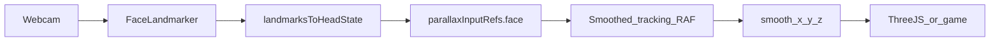

# Praćenje lica kamerom (MediaPipe + React) — kompletan vodič

Samostalan dokument za prenos u drugi repozitorijum. Opisuje **ceo pipeline**: webcam → **MediaPipe Face Landmarker** → landmarks → normalizovan **head state** (x, y, z) → glajenje → potrošač (parallax, igra, UI).

Sve radi **lokalno u browseru** (model i WASM se učitaju sa CDN-a; video ostaje na klijentu ako ga ne šalješ na server).

---

## 1. Zavisnosti

```bash
npm install @mediapipe/tasks-vision
```

Verzija korišćena u referentnoj implementaciji: **0.10.21** (poravnaj `WASM_PATH` sa verzijom paketa).

---

## 2. Model i WASM (fiksni URL-ovi)

U kodu koristi istu verziju paketa i istu WASM putanju:

```ts
const WASM_PATH =
  "https://cdn.jsdelivr.net/npm/@mediapipe/tasks-vision@0.10.21/wasm";
const MODEL_PATH =
  "https://storage.googleapis.com/mediapipe-models/face_landmarker/face_landmarker/float16/1/face_landmarker.task";
```

- `FaceLandmarker.createFromOptions` sa `runningMode: "VIDEO"` i `detectForVideo(video, timestamp)` u petlji `requestAnimationFrame`.
- `delegate: "GPU"` ume da padne na nekim uređajima; u tom slučaju probaj `"CPU"` ili ukloni delegate.

---

## 3. Tipovi stanja

```ts
export type HeadTrackingState = {
  detected: boolean;
  x: number;
  y: number;
  z: number;
  yaw: number;
  pitch: number;
  roll: number;
  confidence: number;
};

export type CalibrationState = {
  centerX: number;
  centerY: number;
  baseFaceWidth: number;
  calibrated: boolean;
};
```

- **x / y**: približno u opsegu **[-1, 1]** (levo/desno, gore/dole) posle mapiranja iz centra lica.
- **z**: „lean“ / dubina iz **odnosa trenutne širine lica** i kalibrisane baze, takođe oko **[-1, 1]**.
- **yaw / pitch / roll**: u ovoj referenci mogu ostati 0; možeš ih kasnije popuniti iz matrice ili drugih landmark izračunavanja.

---

## 4. Deljeni ref objekat (face + miš + landmarks)

MediaPipe callback i miš handler **pišu** ovde; petlja za glajenje **čita**. Tako izbegavaš prop drilling i držiš jedan izvor istine pre store-a.

```ts
import type { NormalizedLandmark } from "@mediapipe/tasks-vision";
import type { HeadTrackingState } from "./types/tracking";

export const parallaxInputRefs = {
  mouse: { x: 0, y: 0, z: 0 },
  face: null as HeadTrackingState | null,
  lastLandmarks: null as NormalizedLandmark[] | null,
};
```

- **lastLandmarks**: prvi niz landmarks-a (`faceLandmarks[0]`) — koristi za **kalibraciju** ili naprednije gesture-e (usta, treptaj).

---

## 5. Matematika: centar, širina, head state

```ts
import type { NormalizedLandmark } from "@mediapipe/tasks-vision";

export function clamp(value: number, min: number, max: number): number {
  return Math.min(max, Math.max(min, value));
}

export function getFaceCenter(
  landmarks: NormalizedLandmark[],
): { x: number; y: number } {
  if (landmarks.length === 0) return { x: 0.5, y: 0.5 };
  let sx = 0;
  let sy = 0;
  for (const p of landmarks) {
    sx += p.x;
    sy += p.y;
  }
  return { x: sx / landmarks.length, y: sy / landmarks.length };
}

export function getFaceWidth(landmarks: NormalizedLandmark[]): number {
  if (landmarks.length === 0) return 0.25;
  let minX = Infinity;
  let maxX = -Infinity;
  for (const p of landmarks) {
    minX = Math.min(minX, p.x);
    maxX = Math.max(maxX, p.x);
  }
  return Math.max(maxX - minX, 1e-4);
}

export function landmarksToHeadState(
  landmarks: NormalizedLandmark[] | undefined,
  calibration: CalibrationState,
  opts: {
    invertX: boolean;
    invertY: boolean;
    sensitivityX: number;
    sensitivityY: number;
    sensitivityZ: number;
  },
): HeadTrackingState {
  if (!landmarks || landmarks.length === 0) {
    return {
      detected: false,
      x: 0,
      y: 0,
      z: 0,
      yaw: 0,
      pitch: 0,
      roll: 0,
      confidence: 0,
    };
  }

  const center = getFaceCenter(landmarks);
  const width = getFaceWidth(landmarks);

  const refX = calibration.calibrated ? calibration.centerX : 0.5;
  const refY = calibration.calibrated ? calibration.centerY : 0.5;
  const baseW = calibration.calibrated
    ? Math.max(calibration.baseFaceWidth, 1e-4)
    : Math.max(width, 1e-4);

  let normalizedX = (center.x - refX) * 2;
  let normalizedY = calibration.calibrated
    ? (refY - center.y) * 2
    : (0.5 - center.y) * 2;

  if (opts.invertX) normalizedX *= -1;
  if (opts.invertY) normalizedY *= -1;

  normalizedX *= opts.sensitivityX;
  normalizedY *= opts.sensitivityY;

  const zRatio = width / baseW;
  const nz = clamp(zRatio - 1, -1, 1) * opts.sensitivityZ;

  return {
    detected: true,
    x: clamp(normalizedX, -1, 1),
    y: clamp(normalizedY, -1, 1),
    z: clamp(nz, -1, 1),
    yaw: 0,
    pitch: 0,
    roll: 0,
    confidence: 1,
  };
}
```

**Kalibracija**: snimi `centerX`, `centerY`, `baseFaceWidth` dok korisnik gleda „u sredinu“ — smanjuje ofset kad kamera nije savršeno centrirana.

---

## 6. Kalibracija jednim klikom

Koristi poslednje landmarks iz ref-a:

```ts
export function useCalibrateFromCurrentFace(
  getStore: () => {
    calibrateFromFace: (cx: number, cy: number, w: number) => void;
  },
) {
  return () => {
    const lms = parallaxInputRefs.lastLandmarks;
    if (!lms?.length) return false;
    const c = getFaceCenter(lms);
    const w = getFaceWidth(lms);
    getStore().calibrateFromFace(c.x, c.y, w);
    return true;
  };
}
```

(Zameni `getStore` svojim Zustand / Context pristupom.)

---

## 7. Hook: `useFaceLandmarker`

Inicijalizacija modela + `requestAnimationFrame` petlja koja zove `detectForVideo`. Opciono **preskakanje frejmova** (`faceDetectEveryNFrames`) radi performansi.

```ts
import {
  FaceLandmarker,
  type FaceLandmarkerResult,
  FilesetResolver,
} from "@mediapipe/tasks-vision";
import { useEffect, useRef, useState } from "react";

const WASM_PATH =
  "https://cdn.jsdelivr.net/npm/@mediapipe/tasks-vision@0.10.21/wasm";
const MODEL_PATH =
  "https://storage.googleapis.com/mediapipe-models/face_landmarker/face_landmarker/float16/1/face_landmarker.task";

export function useFaceLandmarker(
  videoRef: React.RefObject<HTMLVideoElement | null>,
  enabled: boolean,
  onVideoFrame: (result: FaceLandmarkerResult | null) => void,
  faceDetectEveryNFrames: number = 1,
) {
  const [landmarker, setLandmarker] = useState<FaceLandmarker | null>(null);
  const [initError, setInitError] = useState<string | null>(null);
  const onFrameRef = useRef(onVideoFrame);
  onFrameRef.current = onVideoFrame;
  const lastResultRef = useRef<FaceLandmarkerResult | null>(null);
  const frameIndexRef = useRef(0);

  useEffect(() => {
    if (!enabled) {
      setLandmarker(null);
      setInitError(null);
      return;
    }

    let cancelled = false;
    (async () => {
      try {
        const fileset = await FilesetResolver.forVisionTasks(WASM_PATH);
        if (cancelled) return;
        const lm = await FaceLandmarker.createFromOptions(fileset, {
          baseOptions: {
            modelAssetPath: MODEL_PATH,
            delegate: "GPU",
          },
          runningMode: "VIDEO",
          numFaces: 1,
          outputFaceBlendshapes: false,
          outputFacialTransformationMatrixes: false,
        });
        if (!cancelled) {
          setLandmarker(lm);
          setInitError(null);
        }
      } catch {
        if (!cancelled) {
          setLandmarker(null);
          setInitError("init_failed");
        }
      }
    })();

    return () => {
      cancelled = true;
    };
  }, [enabled]);

  useEffect(() => {
    if (!landmarker || !enabled) return;

    let raf = 0;
    const tick = () => {
      const video = videoRef.current;
      if (!video || video.readyState < 2) {
        raf = requestAnimationFrame(tick);
        return;
      }

      const n = faceDetectEveryNFrames;
      frameIndexRef.current += 1;
      if (frameIndexRef.current % n !== 0) {
        onFrameRef.current(lastResultRef.current);
        raf = requestAnimationFrame(tick);
        return;
      }

      const ts = performance.now();
      try {
        const result = landmarker.detectForVideo(video, ts);
        lastResultRef.current = result;
        onFrameRef.current(result);
      } catch {
        onFrameRef.current(lastResultRef.current);
      }
      raf = requestAnimationFrame(tick);
    };

    raf = requestAnimationFrame(tick);
    return () => cancelAnimationFrame(raf);
  }, [enabled, landmarker, videoRef]);

  useEffect(() => () => landmarker?.close(), [landmarker]);

  return { landmarker, initError } as const;
}
```

---

## 8. Provider: od rezultata do `parallaxInputRefs.face`

```tsx
import type { FaceLandmarkerResult } from "@mediapipe/tasks-vision";
import { useCallback, useEffect, type ReactNode } from "react";
import { landmarksToHeadState } from "./faceMath";
import { parallaxInputRefs } from "./parallaxInputRefs";
import { useFaceLandmarker } from "./useFaceLandmarker";

type Props = {
  videoRef: React.RefObject<HTMLVideoElement | null>;
  enabled: boolean;
  children?: ReactNode;
  /** Tvoj store: calibration + invert + sensitivity */
  getTrackingOptions: () => {
    calibration: CalibrationState;
    invertX: boolean;
    invertY: boolean;
    sensitivityX: number;
    sensitivityY: number;
    sensitivityZ: number;
  };
  onStatus: (ready: boolean, error: string | null) => void;
};

export function FaceTrackingProvider({
  videoRef,
  enabled,
  children,
  getTrackingOptions,
  onStatus,
}: Props) {
  const onVideoFrame = useCallback((result: FaceLandmarkerResult | null) => {
    const opts = getTrackingOptions();
    const lms = result?.faceLandmarks?.[0];
    parallaxInputRefs.lastLandmarks = lms ?? null;
    parallaxInputRefs.face = landmarksToHeadState(lms, opts.calibration, {
      invertX: opts.invertX,
      invertY: opts.invertY,
      sensitivityX: opts.sensitivityX,
      sensitivityY: opts.sensitivityY,
      sensitivityZ: opts.sensitivityZ,
    });
  }, [getTrackingOptions]);

  const { landmarker, initError } = useFaceLandmarker(
    videoRef,
    enabled,
    onVideoFrame,
  );

  useEffect(() => {
    if (!enabled) {
      parallaxInputRefs.face = null;
      parallaxInputRefs.lastLandmarks = null;
      onStatus(false, null);
      return;
    }
    if (initError) {
      onStatus(false, initError);
      return;
    }
    onStatus(!!landmarker, null);
  }, [enabled, initError, landmarker, onStatus]);

  return <>{children}</>;
}
```

---

## 9. Miš kao fallback (isti opseg kao x/y)

```ts
export function useMouseParallax(active: boolean) {
  useEffect(() => {
    if (!active) return;

    const onMove = (e: MouseEvent) => {
      parallaxInputRefs.mouse = {
        x: (e.clientX / window.innerWidth - 0.5) * 2,
        y: (0.5 - e.clientY / window.innerHeight) * 2,
        z: 0,
      };
    };

    window.addEventListener("mousemove", onMove, { passive: true });
    return () => window.removeEventListener("mousemove", onMove);
  }, [active]);
}
```

---

## 10. Glajenje: `target` → `smooth`

**composeTarget**: u režimu `face`, ako nema lica, koristi **miš** kao rezervu (korisno kad tracking ispada).

```ts
function composeTarget(
  mode: "face" | "mouse",
  face: HeadTrackingState | null,
  mouse: { x: number; y: number; z: number },
): HeadTrackingState {
  if (mode === "mouse") {
    return {
      detected: false,
      x: mouse.x,
      y: mouse.y,
      z: mouse.z,
      yaw: 0,
      pitch: 0,
      roll: 0,
      confidence: 0,
    };
  }
  if (face && face.detected) return face;
  return {
    detected: false,
    x: mouse.x,
    y: mouse.y,
    z: mouse.z,
    yaw: 0,
    pitch: 0,
    roll: 0,
    confidence: 0,
  };
}

export function lerp(current: number, target: number, factor: number): number {
  return current + (target - current) * factor;
}

export function applyDeadZone(value: number, deadZone: number): number {
  if (Math.abs(value) < deadZone) return 0;
  return value;
}
```

**Preporučeni tuning** (primer):

```ts
const tracking = {
  positionSmoothing: 0.1,
  rotationSmoothing: 0.085,
  zSmoothing: 0.07,
  deadZone: 0.02,
  faceDetectEveryNFrames: 1,
};
```

Petlja (pseudo, sa Zustand `setTarget` / `setSmooth`):

```ts
const nextTarget = composeTrackingTarget(trackingMode, parallaxInputRefs.face, parallaxInputRefs.mouse);
setTarget(nextTarget);
const t = getTarget();
const sm = getSmooth();
setSmooth({
  detected: t.detected,
  confidence: t.confidence,
  yaw: lerp(sm.yaw, t.yaw, tracking.rotationSmoothing),
  pitch: lerp(sm.pitch, t.pitch, tracking.rotationSmoothing),
  roll: lerp(sm.roll, t.roll, tracking.rotationSmoothing),
  x: lerp(sm.x, applyDeadZone(t.x, tracking.deadZone), tracking.positionSmoothing),
  y: lerp(sm.y, applyDeadZone(t.y, tracking.deadZone), tracking.positionSmoothing),
  z: lerp(sm.z, applyDeadZone(t.z, tracking.deadZone), tracking.zSmoothing),
});
```

Potrošač (Three.js, Canvas igra, CSS) čita **`smooth`**, ne sirove landmarks.

---

## 11. Webcam hook (getUserMedia)

```ts
video: {
  width: { ideal: 640 },
  height: { ideal: 480 },
  facingMode: "user",
},
audio: false,
```

- Posle `v.srcObject = stream`: `v.muted = true`, `v.playsInline = true`, `await v.play()`.
- Greške: `NotAllowedError` → korisnik odbio kameru; `NotFoundError` → nema uređaja.

---

## 12. Video element i CSS za MediaPipe

- Uvek renderuj `<video ref={videoRef} playsInline muted />`.
- Za **sakrivanje** sa ekrana ali realne dimenzije za dekodiranje (Face Landmarker):

```css
.hidden-video {
  position: fixed;
  left: -10000px;
  top: 0;
  width: 640px;
  height: 480px;
  opacity: 0;
  pointer-events: none;
}
```

**Omogući face tracking** samo kad: korisnik je ušao u scenu, `trackingMode === "face"`, stream aktivan, `video.readyState` dovoljan (provera u hook-u).

---

## 13. Tok podataka (pregled)



---

## 14. UX i pouzdanost

- Poruke: odbijena dozvola, nema kamere, `init_failed` (model/WASM).
- **Kalibracija** kada korisnik sedi normalno — jedan klik.
- **invertX / invertY** ako osećaj nije prirodan (npr. ogledalo na preview-u).
- Slab uređaj: povećaj `faceDetectEveryNFrames` na 2 ili 3; smanji rezoluciju videa.

---

## 15. Korišćenje u igri ili drugoj aplikaciji

- Ne pokreći drugi Face Landmarker — čitaj **`smooth`** (ili isti ref + svoj smoothing).
- Za **game feel**: dodatni `gain` i mali `extraDeadZone` na `smooth.x/y` pre mapiranja na poziciju igrača.
- U `requestAnimationFrame` petlji igre koristi **`useTrackingStore.getState().smooth`** (ili ekvivalent) da ne zoveš React hook unutar RAF-a.

---

## 16. Checklist pre produkcije

- [ ] HTTPS ili localhost (getUserMedia).
- [ ] Fallback na miš ili tastaturu ako kamera nije dostupna.
- [ ] Jedan `video` element po streamu; `close()` na landmarkeru pri unmount-u.
- [ ] Test u Chrome i Firefox; test bez kamere.
- [ ] Privatnost: jasno da se video ne šalje na server (ako je tako).

---

*Referentna implementacija iz koje je ovaj vodič izveden koristila je React 19, Vite, Zustand i Three.js za prikaz — ti delovi nisu obavezni za sam tracking.*
